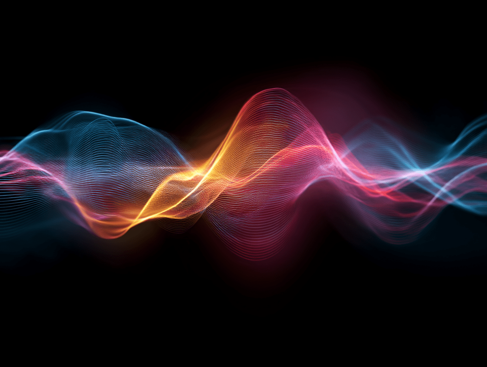

<div align="center">

# Signal Equalizer

**An elegant, professional audio equalizer and analysis toolkit.** <br>
Real-time visualizations • Multi-mode equalization • AI-powered source separation


[View Demo](#quick-demo) • [Report Bug](../../issues) • [Request Feature](../../issues)

</div>

---

## 📋 Table of Contents

* [Overview](#overview)
* [Quick Demo](#quick-demo)
* [Key Features](#key-features)
* [Project Architecture](#project-architecture)
* [Getting Started](#getting-started)
* [Usage Guide](#usage-guide)
* [Technical Details & DSP](#technical-details--dsp)
* [Complete Project Structure](#complete-project-structure)
* [Troubleshooting](#troubleshooting)
* [Contributing](#contributing)
* [License & Contact](#license--contact)

---

## Overview

**Signal Equalizer** is a robust monorepo combining a modern React + TypeScript frontend with a Python FastAPI backend. It is built for audio engineers, researchers, and developers who value transparent DSP implementations and reproducible results.

Core capabilities include STFT-based equalization, interactive spectrum/spectrogram visualizations, and state-of-the-art AI-based source separation (Hybrid Demucs).

---

## Quick Demo

> Demo assets and sample renderings live under `dist/` and `docs/images/` — open the `dist/index.html` in a static server or preview the built site.

---

## Key Features

### 🎛️ Advanced Equalization

* **Preset Modes:** Optimized presets (Musical, Animals, Voices, Musical Instruments).
* **Generic Mode:** User-defined frequency subdivisions with linear gain control.
* **Customized Modes:** Multi-window sliders and content-type selectors for instrument-aware EQ.

### 🎵 AI Source Separation

* **Hybrid Demucs Integration:** Separate tracks into stems (Drums, Bass, Vocals, Other).
* **Visual Feedback:** Spectrograms for separated stems displayed in the UI.

### 📊 Professional Visualization

* Dual linked waveform viewers (pan/zoom/cursor sync), spectrograms with adjustable dynamic range, and high-performance Canvas rendering.

### 🎚️ Playback & Control

* Variable playback speed (0.5×–2×) with minimal artifacts, keyboard accessibility, and ARIA labeling.

---

## Project Architecture

This project is a **Monorepo** with two main components:

| Component   |                     Tech Stack | Responsibility                                 |
| ----------- | -----------------------------: | ---------------------------------------------- |
| Frontend    |     React 18, TypeScript, Vite | UI, WebAudio processing, Canvas visualizations |
| Backend     | Python 3.11+, FastAPI, PyTorch | AI inference (Demucs), DSP endpoints           |
| Docs & Dist |                    Static site | Built frontend assets, demo pages              |

---

## Getting Started

### Prerequisites

* Node.js 16+ and npm/yarn (frontend)
* Python 3.11+ (backend, required only for AI features)

### Frontend (dev)

```bash
cd frontend
npm install
npm run dev
# app typically at http://localhost:5173
```

### Backend (optional — AI features)

```bash
cd backend
python -m venv venv
source venv/bin/activate   # macOS / Linux
pip install -r requirements.txt
python -m app.main
# API docs: http://localhost:8000/docs
```

### Production build (frontend)

```bash
cd frontend
npm run build
npm run preview
```

---

## Usage Guide

1. Import audio via **File Loader** (MP3/WAV/FLAC).
2. Choose a Mode: *Preset*, *Generic*, or *Customized*.
3. Tweak gain sliders (0 → 2x) and use linked viewers to compare input/output.
4. Run AI Source Separation (requires backend running) from the AI tab.
5. Export processed audio or separated stems.

---

## Technical Details & DSP

### DSP Pipeline

* STFT-based processing using Hann window.
* Window size: `2048` samples, hop size: `512` (75% overlap).
* Reconstruction via weighted overlap-add (WOLA).
* FFT: efficient radix-2 Cooley–Tukey implementation (frontend/backend parity).

### AI Model

* Hybrid Demucs, PyTorch & Torchaudio, U-Net + LSTM style architecture.
* Backend exposes async inference endpoints with model caching.

### Performance

* Frontend: Canvas rendering + memoization to reduce React re-renders.
* Backend: Async FastAPI endpoints; model warm-starting and caching.

---

## Complete Project Structure

Below is the integrated folder/file tree for the repository (updated):

```text
.gitignore
README.md

backend/.env.example
backend/app/__init__.py
backend/app/config.py
backend/app/dsp/__init__.py
backend/app/dsp/fft.py
backend/app/dsp/stft.py
backend/app/main.py
backend/app/routers/__init__.py
backend/app/routers/dsp_router.py
backend/app/services/__init__.py
backend/app/services/base_audio_service.py
backend/app/services/demucs_service.py
backend/app/services/dprnn_service.py
backend/requirements-dev.txt
backend/requirements.txt
backend/test_dprnn_model.py
backend/test_refactored_services.py
backend/test_speech_api.py
backend/tests/__init__.py
backend/tests/test_dsp_endpoints.py
backend/tests/test_main.py
backend/tests/test_speech_endpoints.py

dist/assets/index-BaKnEvma.css
dist/assets/index-DxFT9cdG.js
dist/index.html
dist/modes/animals.json
dist/modes/human_voices.json
dist/modes/musical.json
dist/modes/musical_instruments.json
dist/modes/voices.json

docs/images/banner.png

frontend/.eslintrc.cjs
frontend/index.html
frontend/package-lock.json
frontend/package.json
frontend/public/modes/animals.json
frontend/public/modes/human_voices.json
frontend/public/modes/musical.json
frontend/public/modes/musical_instruments.json
frontend/public/modes/voices.json

frontend/src/App.css
frontend/src/App.tsx
frontend/src/__tests__/mixSources.spec.ts
frontend/src/components/AISourceSeparation.tsx
frontend/src/components/BandsList.tsx
frontend/src/components/ChannelStripPanel.tsx
frontend/src/components/Controls.tsx
frontend/src/components/CustomizedMode/AIControls.tsx
frontend/src/components/CustomizedMode/ContentTypeSelector.tsx
frontend/src/components/CustomizedMode/CustomizedMode.css
frontend/src/components/CustomizedMode/DSPControls.tsx
frontend/src/components/CustomizedMode/ModeToggle.tsx
frontend/src/components/CustomizedMode/SourceCard.tsx
frontend/src/components/CustomizedMode/SourceList.tsx
frontend/src/components/CustomizedMode/hooks/useAudioMixing.ts
frontend/src/components/CustomizedMode/hooks/useAudioPlayback.ts
frontend/src/components/CustomizedMode/index.ts
frontend/src/components/CustomizedMode/styles/ContentTypeSelector.module.css
frontend/src/components/CustomizedMode/styles/ModeToggle.module.css
frontend/src/components/CustomizedMode/styles/SourceCard.module.css
frontend/src/components/CustomizedMode/types.ts
frontend/src/components/CustomizedModePanel.old.tsx
frontend/src/components/CustomizedModePanel.tsx
frontend/src/components/DualSpectrogram.css
frontend/src/components/DualSpectrogram.tsx
frontend/src/components/EQTopBar.tsx
frontend/src/components/FileLoader.tsx
frontend/src/components/FrequencyCurveEditor.css
frontend/src/components/FrequencyCurveEditor.tsx
frontend/src/components/GenericMode.css
frontend/src/components/GenericMode.tsx
frontend/src/components/LinkedWaveformViewers.css
frontend/src/components/LinkedWaveformViewers.tsx
frontend/src/components/ModeSelector.tsx
frontend/src/components/ModernModeSelector.css
frontend/src/components/ModernModeSelector.tsx
frontend/src/components/PresetToolbar.tsx
frontend/src/components/ProfessionalBandsPanel.css
frontend/src/components/ProfessionalBandsPanel.tsx
frontend/src/components/SpectrogramPanel.tsx
frontend/src/components/SpectrumChart.css
frontend/src/components/SpectrumChart.tsx
frontend/src/components/TransportBar.css
frontend/src/components/TransportBar.tsx
frontend/src/components/WaveformViewer.tsx
frontend/src/components/WorkflowTabs.css
frontend/src/components/WorkflowTabs.tsx
frontend/src/components/__tests__/GenericMode.spec.ts
frontend/src/components/__tests__/LinkedWaveformViewers.spec.tsx
frontend/src/config/customizedModes.ts
frontend/src/index.css
frontend/src/lib/__tests__/gain_vector.spec.ts
frontend/src/lib/__tests__/modes.spec.ts
frontend/src/lib/__tests__/playback.spec.ts
frontend/src/lib/__tests__/setup.ts
frontend/src/lib/api.test.ts
frontend/src/lib/api.ts
frontend/src/lib/audioMixer.ts
```

---

## Troubleshooting

* **Spectrogram clipping:** Verify STFT parameters in `backend/app/dsp/stft.py` and frontend `lib/stft` implementations match.
* **Model load failures:** Confirm `requirements.txt` packages and GPU/CUDA versions when using GPU-backed PyTorch.
* **CORS / API errors:** If frontend cannot reach backend, confirm `app/main.py` has correct CORS middleware.

---

## Contributing

1. Fork the repo
2. Create a feature branch (`git checkout -b feature/xyz`)
3. Run tests:

   * Frontend: `cd frontend && npm test`
   * Backend: `cd backend && pytest`
4. Commit and open a PR

---

## License & Contact

Distributed under the MIT License. See `LICENSE` for details.

**Maintainer:** Ahmed Shehab — [https://www.linkedin.com/in/ahmed-shehab-engineering/](https://www.linkedin.com/in/ahmed-shehab-engineering/)

---

*Generated: integrated README + updated folder structure.*
